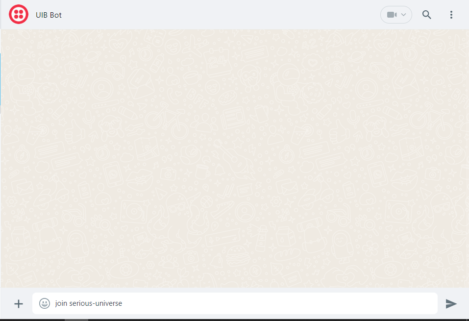
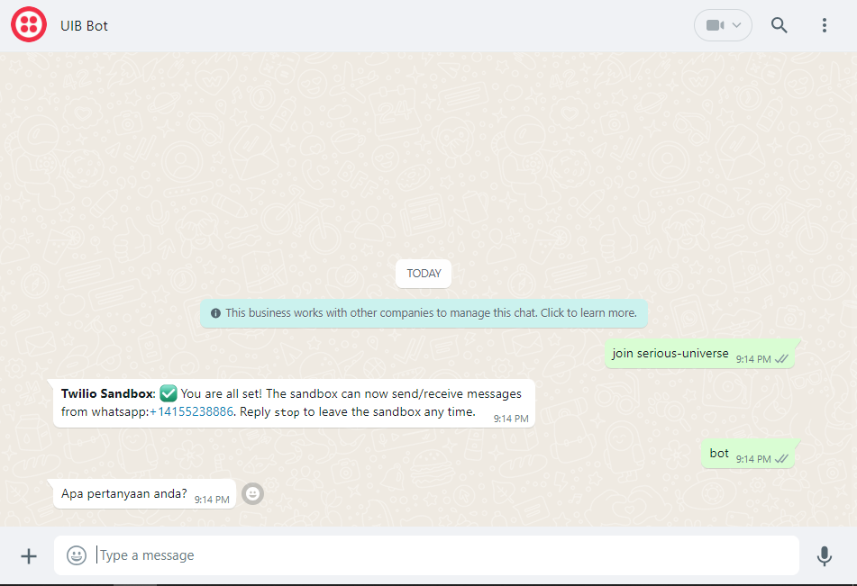
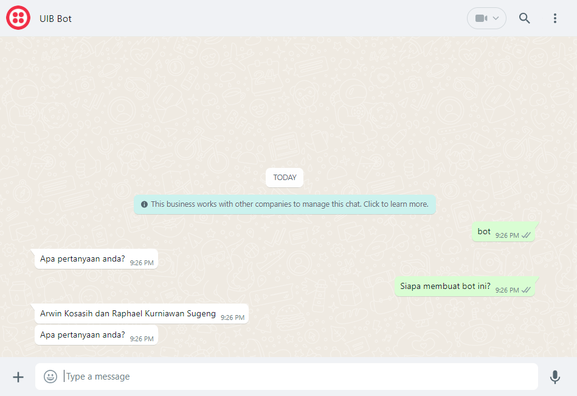

1.  Deskripsi

> Laporan ini adalah laporan mengenai pengerjaan Artificial Intelligence
> ChatBot dari IBM dan penerapannya dalam suatu applikasi. Applikasi
> chatbot ini diintegrasikan ke dalam WatsonX yang memiliki beberapa
> foundational model atau model chatbot yang sudah dilatih dengan
> biliaran data untuk dapat menjawab pertanyaan dari suatu user atau
> pengguna.
>
> Tujuan dari penggunaan dan pembuatan Chatbot adalah pembuatan Chatbot
> yang dapat membantu Universitas Internasional Batam dan menggantikan
> usaha manusia dari administrasi UIB mengenai pertanyaan-pertanyaan
> yang sering ditanyakan oleh mahasiswa baru ataupun lama yang ada di
> UIB.
>
> Penerapan Chatbot ini dapat terjadi dengan penerapan Assistant
> chatbot, Watson Assistant dan juga implementasinya kedalam suatu akun
> bisnis di Whatsapp melalui Twilio.

2.  Proses Implementasi.

> Implementasi sistem ini terdiri dari beberapa tahapan yang sendirinya
> memiliki tahapannya sendiri.

1.  Masuk ke Cloud IBM.

2.  Pembuatan Servis yang akan digunakan.

3.  Pengaturan IBM Watson Assistant

4.  Implementasi ke Twilio/Whatsapp

Tahapan Implementasi:

1.  Masuk Ke Cloud IBM.

<!-- -->

1.  Masuk ke website Cloud IBM <https://cloud.ibm.com/login>.

2.  Masukkan informasi login ke akun yang diberikan Infinite Learning.
    

3.  Klik Login.

<!-- -->

2.  Pembuatan Servis yang akan digunakan.

<!-- -->

1.  Di search bar atas IBM Cloud, search servis berikut ini:

<!-- -->

1.  Watson Assistant

2.  Watson Machine Learning

3.  WatsonX

<!-- -->

2.  Di Watson Assistant, centang box di bawah kanan dan klik

> 

3.  Klik Launch
    Assistant

4.  Namakan Bot anda dan klik next

5.  Isi informasi yang diperlukan dibawah ini dan pilih opsi
    Whatsapp.

6.  Klik Create.

7.  Di Watson Machine Learning klik create

> 

8.  Di WatsonX, klik Get Started di Watsonx

9.  Buat Project dibagian
    bawah

10. Klik add di bagian kanan, dibawah Select storage service.

> 

11. Klik
    Create

12. Kembali ke New Project, klik refresh, namakan project anda dan klik
    create.
    

13. Klik tulisan IBM watsonx di laman
    ini

14. klik Experiment with foundational Model

> 

15. klik Associate Service dan pilih Watson Machine Learning. Dan klik
    associate

> 

16. Prompt lab siap dipakai dan dapat digunakan untuk membuat prompt
    (Dapat digunakan untuk membuat topik nanti.)

> 

3\. Pengaturan Watson Assistant.

1)  Di Watson Assistant, Di ujung kiri, klik
    Integrations

2)  Klik Build Custom
    Extension

3)  Klik Next dan namakan bot
    anda

4)  Download file dari link ini

https://github.com/watson-developer-cloud/assistant-toolkit/blob/master/integrations/extensions/starter-kits/language-model-watsonx/watsonx-openapi.json

5)  Masukkan file yang telah didownload di kotak dibawah import file dan
    klik next dan laman selanjutnya klik finish

6)  Di integration lagi, klik nama extension yang anda buat dan klik
    add

7)  Klik Next dan pada
    bagian

8)  Di Watsonx Prompt lab, klik view code dan Create a personal API
    key

9)  Buat API
    Key

10) Copy API key dan masukkan Kembali di bagian Auth di extension. Ganti
    no authentication menjadi Oauth dan masukkan api key di secret key

11) Klik Next dan finish.

12) Kembali ke watsonx dan dibagian kanan pilih
    Actions.

13) Klik create
    Action

14) Klik start from
    scratch

15) Buat kata untuk memulai percakapan atau memanggil bot. (Bot bisa
    dipanggil atau mulai chat jika dipanggil sesuai kata-kata di tahap
    ini.)

16) Isi text Assistant Says dengan kata yang bot akan pertama minta dari
    pengguna seperti “Apa pertanyaan anda?” dan juga pilih define
    customer response dengan Free Text.
    

17) Dibagian bawah kiri, klik new Step

18) Di bagian Continue next step, ganti dengan use an
    extension.

19) Ganti Extension dengan nama extension yang dibuat dan ganti kolom
    dibawah dengan
    Generation

20) Copy informasi dari View code di Prompt lab dan ganti informasi
    dengan yang sama di view code, untuk model_id dapat diganti dengan
    jenis model yang anda mau gunakan.
    

21) Di bagian input, klik expression dan tulis \$dan masukkan Action
    Step Variable dan step pertama anda.
    

22) Selanjutnya di bagian bawah option parameter, isi seperti
    berikut.

23) Setelah step diatas klik apply dan new step

24) Ganti condition di atas menjadi with condition dan conditionnya
    menjadi if step kedua ran
    successfully

25) set juga action variable di atas kanan, klik new session variable
    dan namain variable tersebut, set juga menjadi free
    text.

26) di bagian kanan variable, klik expression, dan tulis \$, pilih step
    kedua dan body result. Tambahkan setelah body result,
    \[0\]\["generated_text"\]
    

27) di bagian assistant say di step 3, tambahkan session variable yang
    anda buat.
    

28) Kembali ke bagian Action dan klik variable, dapat dilihat variable
    yang dibuat di step 2. Klik new variable, namakan sesuai keinginan
    dan ganti jenis menjadi
    any.

29) Isi bagian initial value dengan prompt yang dibuat di Prompt Lab.
    

30) Pastikan prompt yang dibuat di Prompt lab, di bagian akhirnya ada
    ditulis Pertanyaan:
    

Contoh prompt yang digunakan:

Jawablah pertanyaan berikut ini seperti chatbot pembantu informasi
administrasi universitas. Pertanyaan yang ditanya hanya dapat dijawab
dengan informasi yang diberikan dibawah ini. Apabila informasi yang ada
dibawah ini tidak dapat menjawab pertanyaan, maka jawab dengan "Maaf,
saya tidak mengerti pertanyaan anda." dan output berhenti.

Berikut Informasi yang menjawab pertanyaan:

Anda adalah chatbot dan dibuat oleh Arwin Kosasih dan Raphael Kurniawan
Sugeng

Universitas Internasional Batam adalah kepanjangan dari UIB.

UIB terletak di Jl. Gajah Mada, Tiban Indah, Kec. Sekupang, Kota Batam,
Kepulauan Riau 29426.

UIB memiliki 9 Prodi yaitu berikut:

\- Pendidikan Bahasa Inggris

\- Teknik Sipil

\- Teknologi Informasi

\- Sistem Informasi

\- Manajemen

\- Ilmu Hukum

\- Pariwisata

\- Akutansi

\- Arsitektur.

UIB Akreditasi B.

Jika ada masalah mengenai UIB, no telp BAAK UIB adalah 07787437111.

No telp BAAK UIB adalah 07787437111.

Kepala Prodi sering disebut Kaprodi.

Kaprodi Prodi Teknologi Informasi tidak sama dengan Kaprodi Prodi Sistem
Informasi.

Pengertian jelas dari Apa itu UIB adalah Universitas Internasional yang
terletak di Batam yang sekarang bekerja sama dengan Infinite Learning
dan memiliki Akreditasi B.

UIB buka setiap hari mulai pukul 08.00 s.d. pukul 17.00 waktu Indonesia.

Pertanyaan:

31) Ganti initial value dengan prompt dan klik
    save.

32) Kembali ke step 2, dibagian extension, ganti bagian input di bagian
    expression dan tulis \$, dan masukkan variable yang anda baru buat.
    Buat agar variable ditulis sebelum step 1 dengan +. Berikut gambar
    contohnya

> 4\. Implementasi Watson Assistant dengan Whatsapp/Twilio.

1)  Buat akun Twilio lewat link berikut
    [https://www.twilio.com/try-twilio](https://www.twilio.com/try-twilio)

2)  Ikut proses pembuatan akun dan masuk ke console
    twilio

3)  Setelah pembuatan akun dapat dilihat akun trial anda telah dibuat
    dan diberikan credit untuk mencoba pembelian nomor
    telpon

4)  Klik phone numbers, manage dan buy a number.
    

5)  Klik di salah satu no telp di US/Amerika serikat dan pesan salah
    satu no telp (Tidak menggunakan uang asli, hanya credit dari akun
    trial), klik buy di bagian bawah saat memesan no
    telp

6)  Sekarang anda sudah membeli no telp amerika untuk akun bisnis.
    Kembali ke console twilio dengan klik di bagian atas kanan.

7)  Pergi ke integration di Watson Assistant dan pergi ke Whatsapp with
    Twilio.
    

8)  Klik add dan
    next

9)  Di bagian account SID, bisa di ambil dari Twilio dibagian bawah
    console

10) Di bagian auth token juga masukan Auth Token dari Twilio, dan klik
    next setelah sudah
    dimasukan

11) Copy webhook yang diberikan dan klik finish diatas
    kanan.

12) Kembali ke Console Twilio dan dibagian kiri klik Messaging, Try it
    out dan Send message to
    Whatsapp

13) Di bagian atas, klik Sandbox settings dan masukkan webhook yang
    didapat dari Watson Assistant ke kolom samping POST dan klik
    save.

14) Kembali lagi ke Sandbox dan di bagian bawah ada Open Whatsapp. Klik
    itu dan juga saat membuka Whatsapp akan membuka no telp ke Twilio
    serta message di kolom bawah ke Twilio.
    

15) Kirim pesan dari kolom chat ke no telp bot

16) Setelah mengirim pesan, bot sudah tersambung ke no telp whatsapp.
    Bot dapat dipanggil seperti Preview dalam Watson Assistant dengan
    perintah pemanggil yang ditetapkan.
    

17) Chatbot di Whatsapp seharusnya sudah berjalan lancar dan membuat
    prompt dari prompt lab seperti di prompt lab namun masih ada
    perbedaan sedikit dari hasil prompt lab terutama pada model
    tertentu.
